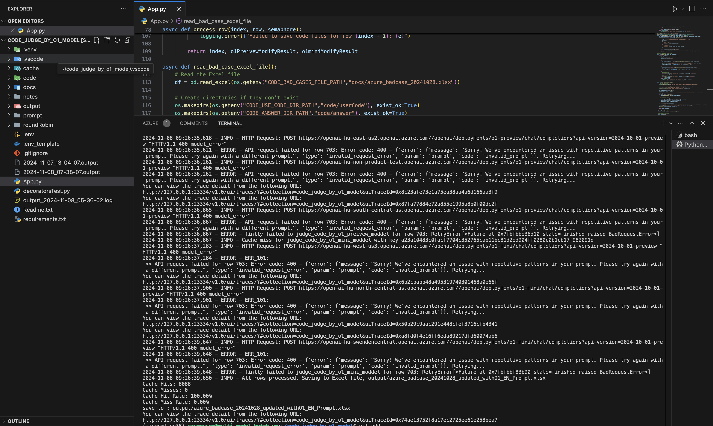

## o1-preview & o1-mini as coding trainer to comment code by answer and instruction

The model of o1-preview & o1-mini is poorer performance and more expensive, so we need more resiliecne and monitor function.

## 性能： 通过使用asyncOpenAI ，async 方法，和信号量，multi-thread，multi-process 来完成请求

	需要注意点：
	  
	https://platform.openai.com/docs/guides/rate-limits
	
	a）本身有limitation，并且不管是RPM还是TPM ，是或条件的触发
	
    b） 在使用azure openAI过程中，即使没有达到这些TPM 或者RPM 依然可能触发 429错误
    
    c)  在批处理之前，除了计算和估量并发数等，还实际测试一下，得到一个保守值（因为retry也是需要计算token）

##  trace log 和  app log

    a） 通过使用promptflow的sdk 简单的start_trace的方法，可以收集到对应的请求参数

    b）使用python log 库，保留在本地log文件，方便查看。包括使用ELK，或者 azure monitor集成等

## 重试机制
      
      a） 本身openAI的库里面，包括azureOpenAI 库里面已经提供了对应的参数，参见下面的内容

      b） 也可以使用开源package 实现更客户化的重试机制

##  cache
     
     1) 内存缓存

     https://realpython.com/lru-cache-python/

     2） diskcache
        磁盘文件缓存( 装饰 但是不支持异步)

     	与其他Python缓存库相比，DiskCache有以下优势：
		
        持久化缓存：DiskCache将缓存数据存储在磁盘上，可以长期保存缓存，即使程序重启也不会丢失。而内存缓存库如Redis在程序重启时会丢失缓存数据。
		
        海量缓存容量：由于利用磁盘存储，DiskCache可以存储大量数据，而内存缓存通常受限于可用内存大小。
		
        多种缓存策略：DiskCache支持LRU、LFU、FIFO等多种缓存替换策略，可以根据业务需求灵活选择。
		
        丰富的功能：DiskCache提供事务支持、缓存压缩、并发控制等高级特性，满足各种复杂的缓存需求。

        issue:
        https://github.com/grantjenks/python-diskcache/issues/282

        异步cache （aiocache）
        https://github.com/aio-libs/aiocache （支持redis之类的）

        以及整合方案：选择redis还是disk都可以兼容

        https://github.com/Krukov/cashews
    

     3） prompt cache

        https://platform.openai.com/docs/guides/prompt-caching

## 执行

    nohup python App.py > "output_$(date '+%Y-%m-%d_%H-%M-%S').log" 2>&1 &
    tail -f output_XXX.log

## 执行结果

